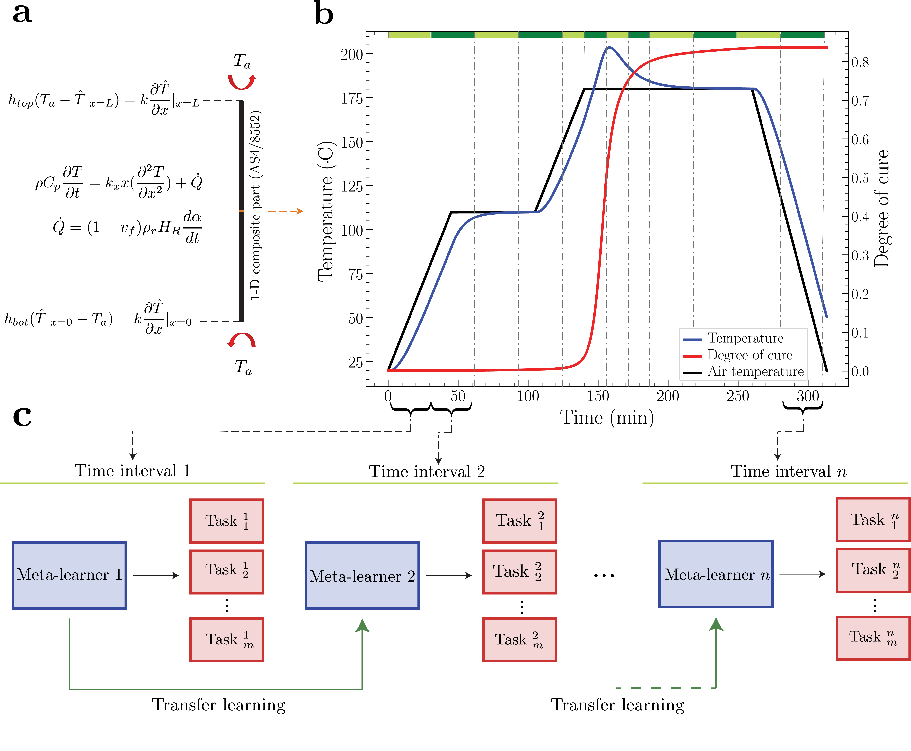

[Code to be released soon] This repository presents a JAX implementation of the paper entitled "Meta-Transfer Sequential Learning of Physics-Informed Neural Networks in Advanced Composites Manufacturing". The proposed framework integrates a sequential learning strategy with the meta-transfer learning approach to make the training of PINNs in complex and highly nonlinear system more efficient and adaptable. 

### Proposed sequential meta-transfer learning framework

### Two sequential learning methods: a) time marching and b) backward-compatibility

